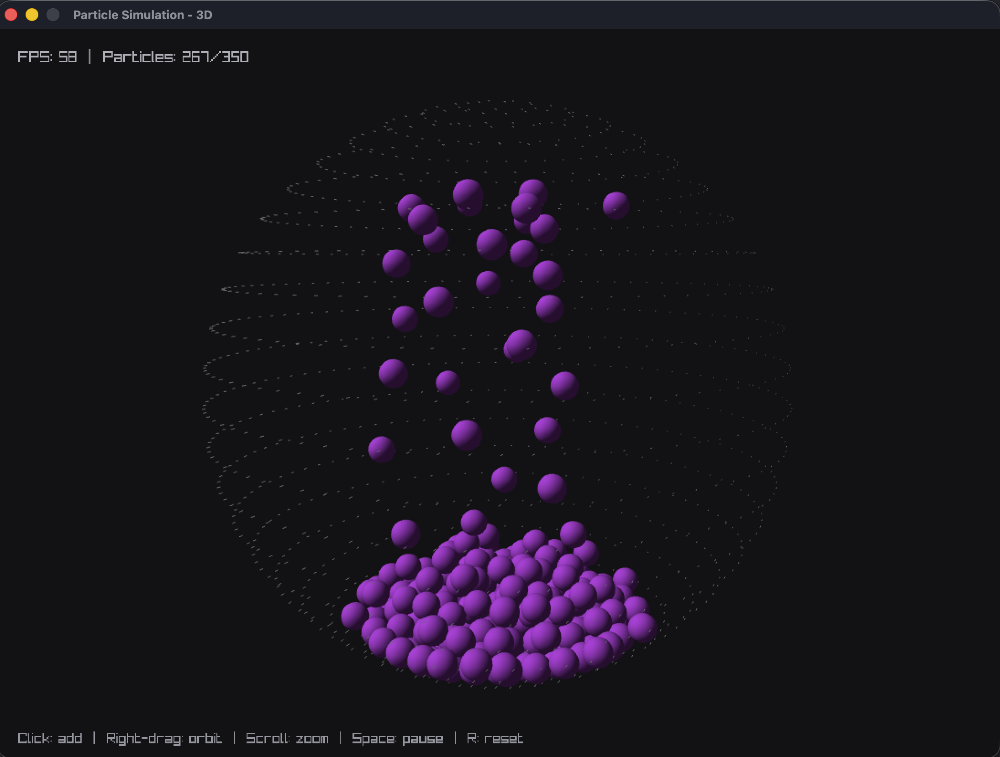

# Particle Simulation



A C and raylib simulation of free-moving, equal-mass particles inside a dotted
3D sphere. Uses fixed-step Verlet motion, damped particle collisions, and a
spherical boundary. Gravity pulls particles downward at 9.81 meters per second
squared. The boundary dots rotate around the vertical axis at 0.075 radians per
second; this visual rotation does not drag particles or change the collision surface.
The window has a fixed size of 1100 by 800 pixels.

## Build and run (macOS with Homebrew)

```sh
brew install raylib pkgconf
cc -O2 -std=c11 -Wall -Wextra main.c $(pkg-config --cflags --libs raylib) -o particle_simulation
./particle_simulation
```

## Controls

- Left-click an empty spot inside the sphere to add a particle on the central
  plane facing the camera. New particles move into the scene.
- Right-drag to orbit; scroll to zoom.
- Space pauses or resumes the physics and boundary rotation.
- R resets to the original twelve particles and restarts the rain and boundary rotation.
- Escape closes the window.

The simulation supports up to 350 particles. Spawns outside the container or
inside an existing particle are rejected. Collision checks use all pairs and
eight resolution passes at 120 physics steps per second. Very fast particles can
still cross between steps, and crowded contacts may retain small overlaps.

Particles rain in at up to 25 per second until the total reaches 350. Impacts
retain 25% of the incoming normal relative speed; gentle contacts do not bounce.
Contact friction reduces sliding so particles settle into a pile. Space also
pauses the rain. Click spawning shares the same capacity limit.
