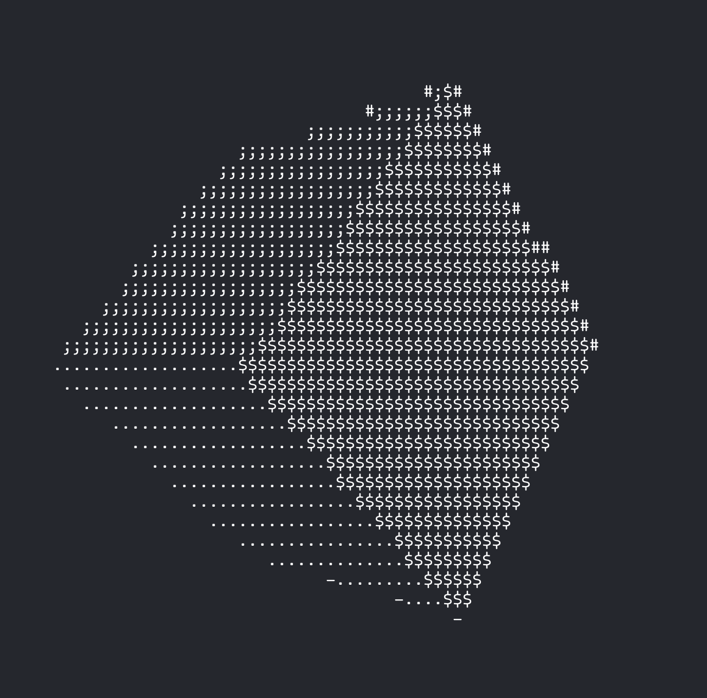

# Spinning Cube

**Status: Complete.**

A learning project in C that renders a spinning 3D cube in the terminal using ASCII characters. It draws all six faces with distinct characters, using 3D rotation, perspective projection, and a depth buffer to keep the closest surfaces visible.



Inspired by [ASMR Programming — Spinning Cube](https://www.youtube.com/watch?v=p09i_hoFdd0).

## Build and run

On macOS or Linux, compile with a C compiler and link the math library:

```sh
cc cube.c -o cube -lm
./cube
```

Use a terminal that supports ANSI escape sequences, with room for 160 columns and 44 rows. Press `Ctrl+C` to stop the animation.
